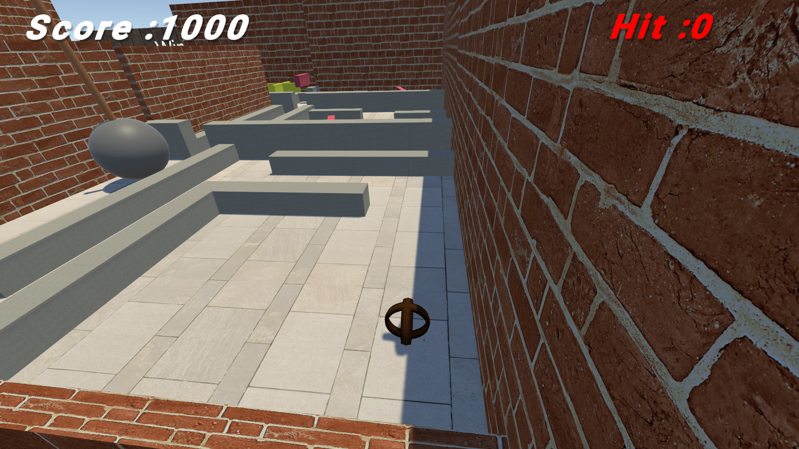

# Unity 3D Maze Game

## Version

Current Version: 1.0.0.4

Welcome to the Unity 3D Maze Game repository! This project showcases an exciting and challenging game built with Unity 3D. Navigate through a complex maze as a ball, encountering various obstacles and puzzles in each room. The game offers an intermediate level of difficulty to keep you engaged and entertained.

## Installation

To run the Unity 3D Maze Game project on your local machine, follow these steps:

1. Clone the repository: `git clone https://github.com/Sayedelmahdy/The-Maze-Game.git`
2. Open Unity 3D and navigate to the cloned project folder.
3. Import the project into Unity 3D.
4. Ensure you have the necessary dependencies and a compatible version of Unity 3D.
5. Build and run the game in the Unity 3D editor or export it to your preferred platform.

## Gameplay Setup

If you want to play the Unity 3D Maze Game without Unity 3D installed, follow these steps:

1. Download the game setup file from [this link](https://www.mediafire.com/file/80b7qk647y8k74r/The+maze.exe/file).
2. Open the downloaded file (`The Maze.exe`).
3. Follow the on-screen instructions to install the game on your computer.
4. Once the installation is complete, locate the game in your installed applications or desktop shortcut.
5. Launch the game and enjoy the immersive maze experience!

## Features

- **Maze navigation:** Control the ball's movement using intuitive controls to explore the intricately designed maze.
- **Obstacles:** Encounter different types of obstacles in each room, such as moving platforms, spikes, and rotating objects, adding an extra layer of challenge to your journey.
- **Puzzles:** Solve unique puzzles in each room to unlock doors, activate switches, or reveal hidden paths. Put your problem-solving skills to the test!
- **Intermediate difficulty:** The game strikes a balance between accessibility and challenge, offering an engaging experience for players with some experience in maze games.

## Contributing

We welcome contributions to the Unity 3D Maze Game repository. If you have any ideas for improvements, bug fixes, or new features, please follow these steps:

1. Fork the repository.
2. Create a new branch for your feature or bug fix: `git checkout -b feature/your-feature` or `git checkout -b bugfix/your-bugfix`.
3. Make your modifications and enhancements.
4. Test thoroughly and ensure compatibility with the existing project.
5. Commit your changes: `git commit -m "Add your commit message here"`.
6. Push to your branch: `git push origin feature/your-feature` or `git push origin bugfix/your-bugfix`.
7. Submit a pull request detailing your changes and their benefits.

## Credits

This project was developed by [Sayed Elmahdy]. Special thanks to the following resources:

- [Unity Technologies](https://unity.com/) for providing the Unity 3D game engine.
- [Asset Store Name](https://assetstore.unity.com/packages/2d/textures-materials/floors/yughues-free-ground-materials-13001) for the [Ball and Texture] used in the game.
- Any other individuals or resources deserving acknowledgment.

## Contact

If you have any questions, suggestions, or feedback regarding the Unity 3D Maze Game, feel free to reach out to us at [sayed.work223@gmail.com]. We appreciate your interest and support!
